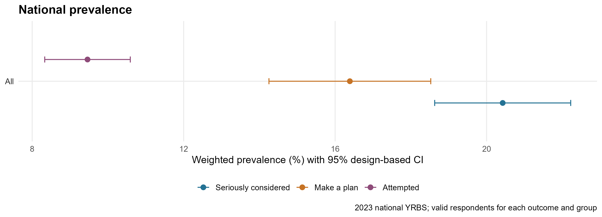
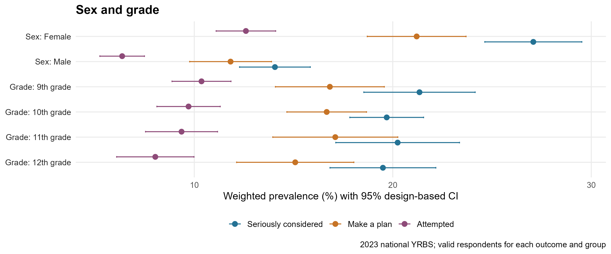
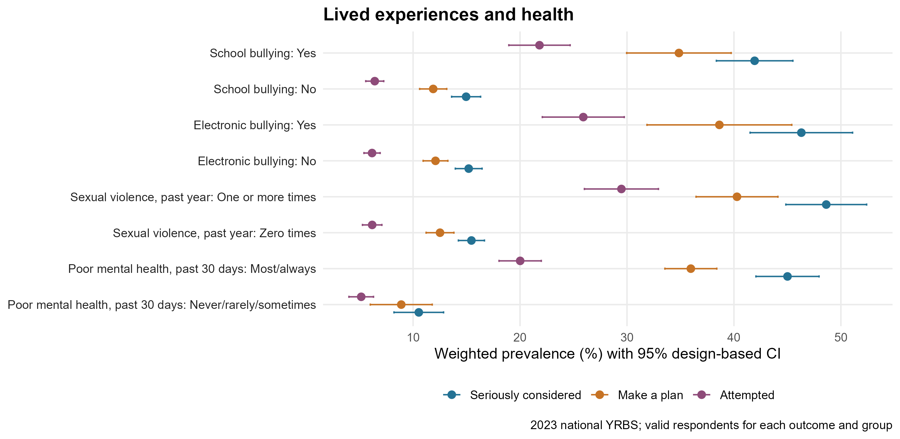
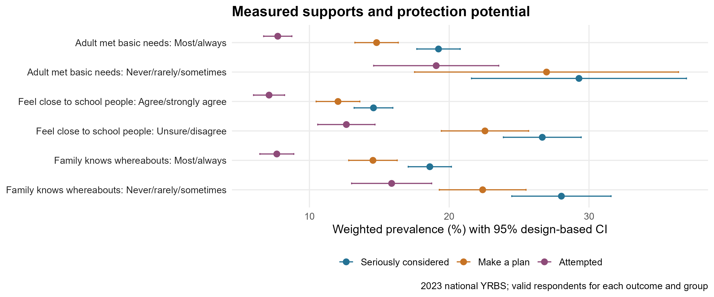

```{r setup, include=FALSE}
knitr::opts_chunk$set(echo=FALSE, warning=FALSE, message=FALSE)
stopifnot(file.exists('outputs/prevalence_by_group.csv'))
p <- read.csv('outputs/prevalence_by_group.csv', check.names=FALSE)
co <- read.csv('outputs/cooccurrence.csv')
quality <- read.csv('outputs/data_quality.csv')
format_row <- function(a) {
  x <- a
  x$estimate <- sprintf('%.1f%% (%.1f–%.1f)',x$percent,x$lower,x$upper)
  x[,c('category','outcome','n','estimate')]
}
show_section <- function(section, pattern=NULL) {
  selected_groups <- switch(section,
    'Demographic distribution'=c('Demographic distribution','Sex','Grade','Race/ethnicity'),
    'Lived experiences, health and behaviour'=c('Lived experiences, health and behaviour','School bullying','Electronic bullying','Sexual violence, past year','Sad or hopeless','Poor mental health, past 30 days','Binge drinking, past 30 days','Ever used marijuana','School-night sleep','Unstable housing, past 30 days','Household adult substance problem','Household adult mental illness/suicidality'),
    'Protection potential: measured supports'=c('Protection potential: measured supports','Adult met basic needs','Feel close to school people','Family knows whereabouts'),
    section)
  x <- p[p$group %in% selected_groups,]
  if (!is.null(pattern)) x <- x[grepl(pattern,x$category),]
  names(x)[names(x)=='category'] <- 'Category'
  names(x)[names(x)=='outcome'] <- 'Outcome'
  x$Estimate <- sprintf('%.1f%% (%.1f–%.1f)',x$percent,x$lower,x$upper)
  knitr::kable(x[,c('Category','Outcome','n','Estimate')],caption=paste(section,'weighted prevalence and 95% CI'),row.names=FALSE)
}
```

# Abstract

**Background:** Self-reported suicidal thoughts, plans, and attempts are important indicators of adolescent distress. **Methods:** We analyzed the 2023 national Youth Risk Behavior Survey of students in grades 9–12 attending US public and private schools, applying student weights and stratified primary sampling units. **Results:** Weighted past-year prevalence was 20.4% for seriously considering an attempt, 16.4% for making a plan, and 9.5% for attempting suicide. The outcomes overlapped and varied across demographic groups, lived experiences, health and behaviour, and measured supports. **Conclusion:** These cross-sectional self-reports identify population patterns and possible targets for further investigation; they do not establish causes or intervention effects.

# Introduction

Suicidal thoughts, plans and attempts are distinct self-reported outcomes with a substantial burden among US high school students. In an analysis of the 2021 national Youth Risk Behavior Survey (YRBS), Gaylor et al. (2023) found higher prevalence of each outcome among female than male students and documented differences across other demographic groups. This makes it useful to describe the three outcomes separately, as well as their overlap, in the 2023 national survey.

Students' experiences may also matter. Nguyen et al. (2023) reported associations between in-school and electronic bullying and suicide-related outcomes in adolescents, while Marraccini and Brier's (2017) meta-analysis found that stronger school connectedness was associated with fewer reported suicidal thoughts and behaviours across school-age samples. Using the 2023 national YRBS, Verlenden et al. (2024) reported lower prevalence of suicide risk indicators among students reporting school connectedness and several household supports. Their analysis uses the **same survey cycle** as the present study, so agreement with it is a check on interpretation rather than independent replication.

We estimate the weighted prevalence of **Seriously considered**, **Make a plan** and **Attempted**, examine demographic variation and joint responses, and compare reported lived experiences, health and behaviour, and measured supports. Here **protection potential** denotes an observed association with a support, not evidence that the support prevented an outcome. The source questionnaire and coding guide describe the underlying items (CDC, 2023c; CDC, 2024).

# Methodology

We used the attached `XXHq` raw response file (20,103 records) and the accompanying 2023 data user's guide (CDC, 2023a; CDC, 2024). The outcome variable names are those in the coded data guide: Q27=1 for **Seriously considered**, Q28=1 for **Make a plan**, and Q29=2–5 for **Attempted**, all referring to the preceding 12 months. Q29=1 indicates zero attempts. Blank or invalid responses are excluded from that outcome's denominator. The derived-indicator file `XXHqn.txt` (CDC, 2023b) is joined by the unique `record` identifier, validated against raw recodes, and its QN27–QN29 variables are used for estimates.

We estimated survey-weighted proportions with `survey::svydesign(ids=~psu, strata=~stratum, weights=~weight, nest=TRUE)` and domain estimates for each reported group. Confidence intervals use the estimated standard error, a t critical value with PSU-minus-stratum degrees of freedom, and truncation to 0–100%. Overlap patterns use respondents with nonmissing answers to all three outcomes. We provide unweighted response counts alongside weighted percentages; weighted counts are scaled to sample size and are not population totals. R code and exact run instructions are in `R/01_analysis.R` and `README.md`.

Race/ethnicity combines guide categories 6 and 7 as Hispanic/Latino, any race. The survey records sex as female or male and does not measure gender identity in Q2. Support comparisons use Q99 (adult meeting basic needs), Q103 (closeness to people at school), and Q104 (family monitoring). Categories and missingness are specified in `outputs/data_quality_summary.md`.

# Results

## Overall distribution

```{r overall}
show_section('Overall')
```

```{r fig1, out.width='95%', fig.cap='Figure 1. Survey-weighted prevalence of the three outcomes. Horizontal ranges represent approximate 95% design-based confidence intervals.'}

```

## Demographic variation

Female respondents reported all three outcomes more often than male respondents; grade differences were comparatively modest. Some race/ethnicity categories have wide intervals and should not be ranked from point estimates alone.

```{r demo}
show_section('Demographic distribution')
```

```{r fig2, out.width='95%', fig.cap='Figure 2. Outcomes by reported sex and grade. See table for race/ethnicity estimates.'}

```

## Overlap among outcomes

The joint pattern table uses a common complete-response denominator, enabling the shares to sum to approximately 100%. It describes co-reporting, without assuming a sequence from thought to plan to attempt.

```{r overlap}
co$Estimate <- sprintf('%.1f%% (%.1f–%.1f)',co$percent,co$lower,co$upper)
knitr::kable(co[,c('pattern','n','Estimate')],col.names=c('Response pattern','Unweighted n','Weighted share (95% CI)'),caption='Eight mutually exclusive patterns among complete respondents')
```

## Lived experiences, health and behaviour

The strongest descriptive contrasts appear for bullying, sexual violence, feeling sad or hopeless, and frequent poor mental health. These are separate, unadjusted group comparisons; their time windows vary.

```{r experiences}
show_section('Lived experiences, health and behaviour')
```

```{r fig3, out.width='95%', fig.cap='Figure 3. Selected lived experiences and health measures associated with the three outcomes.'}

```

## Protection potential

Prevalence was lower among respondents reporting a household adult who consistently met basic needs, closeness to people at school, and frequent family knowledge of whereabouts. None of these comparisons isolates an effect of support from other circumstances.

```{r supports}
show_section('Protection potential: measured supports')
```

```{r fig4, out.width='95%', fig.cap='Figure 4. Measured supports and the three outcomes. These are unadjusted associations.'}

```

# Discussion

## Comparison with previous findings

The overall estimates here—20.4% **Seriously considered**, 16.4% **Make a plan** and 9.5% **Attempted**—indicate that thoughts and plans are more frequently reported than attempts. The corresponding female–male contrasts are also substantial: 27.1% versus 14.1% for **Seriously considered** and 12.6% versus 6.4% for **Attempted**. Gaylor et al. (2023) likewise reported higher 2021 prevalence among female students for all three outcomes. These surveys were conducted in different years; this report does **not** formally test a 2021-to-2023 trend. Verlenden et al. (2024) reported the same 2023 national prevalence of 20.4% for serious consideration and 9.5% for attempts, which is expected because they analysed the same source survey. The race and ethnicity pattern also differs by outcome: for example, White students report more **Seriously considered** than Hispanic/Latino students here, whereas Hispanic/Latino students report more **Attempted** than White students. Verlenden et al. (2024) noted the same distinction. Small-group confidence intervals in our table limit stronger interpretation.

The higher prevalence among students reporting school or electronic bullying aligns in direction with Nguyen et al. (2023), who studied bullying and suicide-related outcomes in another adolescent data analysis. Our estimates are separate, unadjusted contrasts; their findings cannot establish that bullying preceded an outcome in this 2023 sample. The particularly large contrasts for sad or hopeless feelings and frequent poor mental health also show how closely these self-reports co-occur, without implying that the measures are interchangeable or causally ordered. Each outcome can overlap the others, yet the complete-response table includes students reporting an attempt without a reported plan or serious consideration. Those patterns warrant careful interpretation of question wording, recall and item nonresponse rather than treating the outcomes as obligatory stages.

School closeness and the two household supports are associated here with lower prevalence of all three outcomes. This is consistent with Marraccini and Brier's (2017) meta-analysis on school connectedness and with Verlenden et al.'s (2024) adjusted 2023 YRBS analysis of school and household supports. Our support categories are collapsed differently from some of their measures and our estimates are **unadjusted**, so the percentages and their adjusted prevalence ratios should not be compared as if they measure the same effect. This analysis therefore identifies a plausible research direction, not an intervention benefit.

## Strengths and limitations

The national sample, design variables and explicit missing-response denominators allow survey-aware description of the target school population. The source is cross-sectional and self-reported; exposure and outcome recall periods differ, and adjustment for shared causes was not performed. Nonattendance and exclusion of adolescents outside school restrict generalisation. Several later items have considerable missingness, while small subgroup estimates are imprecise. The published studies provide context for the observed associations; none independently validates the causal interpretation of these particular contrasts.

# Conclusion and Recommendation

In the 2023 national survey, **Seriously considered**, **Make a plan** and **Attempted** are common, overlap substantially and vary across student groups and reported experiences. The lower prevalence among students who report school and household supports is descriptive. Public-health planning can use these patterns to prioritise supportive school environments, accessible help and further study while avoiding causal claims from the current analysis.

**Next research question:** Among students with comparable demographic and adversity profiles, does school connectedness remain associated with **Attempted**, and does that association vary by grade or reported sex? A planned survey-adjusted analysis could examine robustness to measured confounding; longitudinal data would be needed to establish temporal direction.

# References

Gaylor, E. M., Krause, K. H., Welder, L. E., et al. (2023). [Suicidal thoughts and behaviors among high school students—Youth Risk Behavior Survey, United States, 2021](https://www.cdc.gov/mmwr/volumes/72/su/su7201a6.htm). *Morbidity and Mortality Weekly Report Supplements, 72*(1), 45–54. https://doi.org/10.15585/mmwr.su7201a6

Marraccini, M. E., & Brier, Z. M. F. (2017). [School connectedness and suicidal thoughts and behaviors: A systematic meta-analysis](https://pubmed.ncbi.nlm.nih.gov/28080099/). *School Psychology Quarterly, 32*(1), 5–21. https://doi.org/10.1037/spq0000192

Nguyen, T. H., Shah, G., Muzamil, M., Ikhile, O., Ayangunna, E., & Kaur, R. (2023). [Association of in-school and electronic bullying with suicidality and feelings of hopelessness among adolescents in the United States](https://www.mdpi.com/2227-9067/10/4/755). *Children, 10*(4), 755. https://doi.org/10.3390/children10040755

Verlenden, J. V., Fodeman, A., Wilkins, N., et al. (2024). [Mental health and suicide risk among high school students and protective factors—Youth Risk Behavior Survey, United States, 2023](https://www.cdc.gov/mmwr/volumes/73/su/su7304a9.htm). *Morbidity and Mortality Weekly Report Supplements, 73*(4), 79–86. https://doi.org/10.15585/mmwr.su7304a9

## Source materials for this analysis

Centers for Disease Control and Prevention (CDC). (2023a). *2023 national YRBS raw student response data* (`data/XXHq.txt`; supplied data file).

Centers for Disease Control and Prevention (CDC). (2023b). *2023 national YRBS derived indicator data* (`data/XXHqn.txt`; supplied data file).

Centers for Disease Control and Prevention (CDC). (2023c). *2023 National Youth Risk Behavior Survey: High school questionnaire* ([supplied PDF](docs/2023_YRBS_National_HS_Questionnaire.pdf)).

Centers for Disease Control and Prevention (CDC). (2024). *2023 National YRBS data user's guide* ([supplied PDF](docs/2023_National_YRBS_Data_Users_Guide.pdf)).
